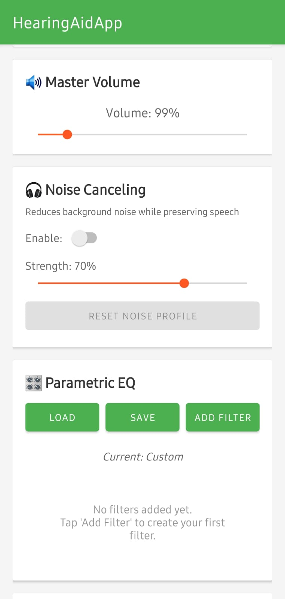
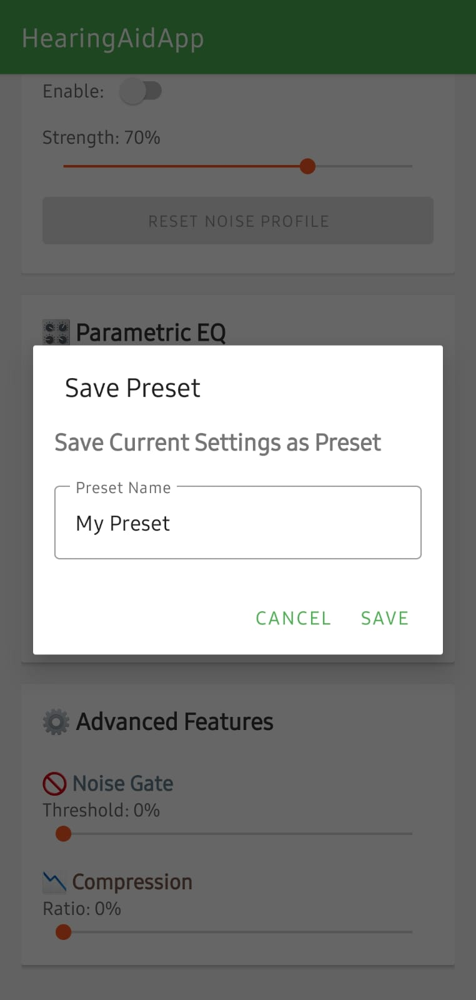
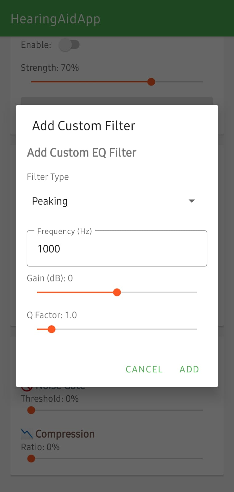
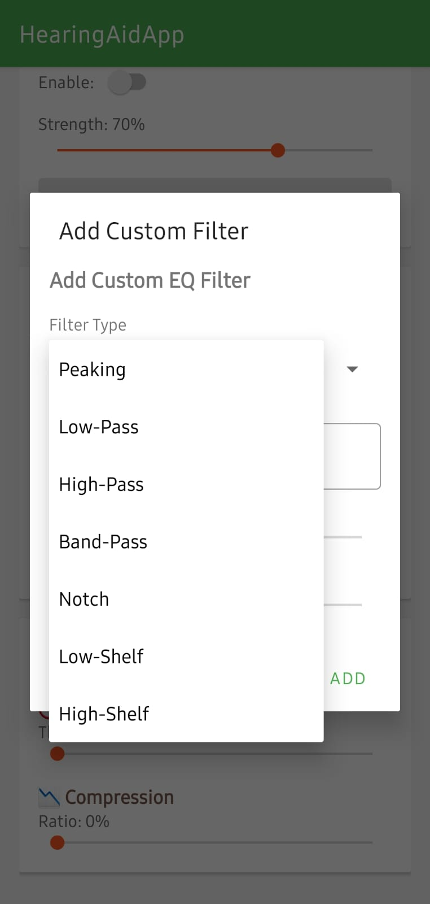
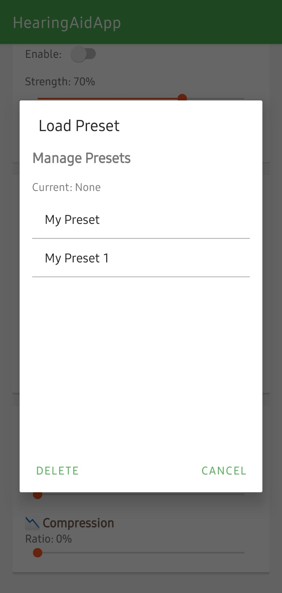

# 🎧 Hearing Aid Software Application

<div align="center">


**A professional-grade Android hearing aid application with real-time audio processing, noise canceling, and customizable parametric equalizer.**

[Features](#-features) • [Installation](#-installation) • [Usage](#-usage) • [Documentation](#-documentation) • [Contributing](#-contributing)

</div>

---

## 📋 Overview

This Android application transforms your smartphone into a powerful hearing aid device with ultra-low latency audio processing. Built with Kotlin, it offers advanced features including dynamic parametric equalization, spectral subtraction-based noise canceling, and customizable audio presets tailored for various hearing needs.

> **⚠️ IMPORTANT:** This software contains patented technology and is protected by copyright. See [COPYRIGHT](COPYRIGHT.md) and [PATENT](PATENT.md) for details. Commercial use requires a separate license.

### ✨ Key Highlights

- **Ultra-Low Latency**: ~2.6ms processing delay at 48kHz sample rate
- **Dynamic EQ System**: Unlimited custom filter bands with precise control
- **Noise Canceling**: Adaptive spectral subtraction with Wiener filtering
- **Preset Management**: Save, load, and customize unlimited audio profiles
- **Real-time Visualization**: Waveform and frequency spectrum displays
- **Professional Audio**: Biquad filter implementation for high-quality processing

---

## 🎯 Features

### 🎚️ Dynamic Parametric Equalizer
- **Unlimited EQ Bands**: Add custom filters at any frequency (20Hz - 20kHz)
- **Precise Control**: Adjust gain (-20dB to +20dB) and Q factor (0.1 to 10.0)
- **Multiple Filter Types**: Peaking, Low-Pass, High-Pass, Band-Pass, Notch, Low-Shelf, High-Shelf
- **Real-time Processing**: Changes apply instantly without audio interruption

### 💾 Intelligent Preset System
- **5 Built-in Presets**:
  - **Flat**: Neutral reference
  - **Speech Clarity**: Optimized for conversation understanding
  - **Bass Boost**: Enhanced low frequencies
  - **High Freq Loss**: Compensation for age-related hearing loss
  - **Music**: Balanced profile for music enjoyment
- **Custom Presets**: Save unlimited personalized configurations
- **Preset Management**: Rename, delete, and organize your presets
- **Persistent Storage**: All settings saved automatically

### 🔇 Advanced Noise Canceling
- **Spectral Subtraction**: Intelligent background noise removal
- **Adaptive Learning**: Builds noise profile from environment
- **Adjustable Strength**: 0-100% noise reduction control
- **Wiener Filtering**: Advanced noise suppression algorithm

### 🎛️ Professional Audio Controls
- **Master Volume**: Amplification gain control
- **Noise Gate**: Threshold-based silence suppression (0-10%)
- **Dynamic Compression**: Comfortable listening range (0-100%)
- **Real-time Adjustments**: All parameters adjustable while running

### 📊 Real-time Visualization
- **Waveform Display**: Live audio signal visualization
- **Spectrum Analyzer**: 64-band frequency display with color gradient
- **FFT Processing**: 512-point Fast Fourier Transform
- **Logarithmic Scaling**: Professional-grade frequency representation

---

## 🛠️ Technical Specifications

| Component | Specification |
|-----------|--------------|
| **Platform** | Android API 21+ (Android 5.0 Lollipop and above) |
| **Language** | Kotlin |
| **Audio Framework** | AudioRecord / AudioTrack with low-latency optimization |
| **Sample Rate** | 48kHz (device native) |
| **Processing Chunk** | 128 samples (~2.6ms latency) |
| **Filter Algorithm** | Biquad IIR filters |
| **FFT Size** | 512 points |
| **Storage** | SharedPreferences with JSON serialization |
| **UI Framework** | Material Design Components, Jetpack Compose |

---

## 📱 Screenshots

### Main Interface
The primary control panel with all essential features at your fingertips.

<p align="center">
  
</p>

### Dynamic Parametric Equalizer
Unlimited custom EQ filters with precise frequency, gain, and Q factor control.

<p align="center">
  
</p>

### Preset Management System
Save, load, and manage unlimited audio presets for different environments.

<p align="center">
  
</p>

### Noise Canceling Features
Adaptive noise canceling with strength control and real-time status display.

<p align="center">
  
</p>

### Real-time Visualization
Waveform and spectrum analyzer showing live audio processing.

<p align="center">
  
</p>

---

## 🚀 Installation

### Prerequisites

- **Android Studio** Arctic Fox (2020.3.1) or later
- **JDK** 11 or higher
- **Android SDK** API 21-36
- **Gradle** 8.0+
- **Physical Android Device** or **Android Emulator** (API 21+)

### Steps

1. **Clone the Repository**
   ```bash
   git clone https://github.com/Rxhulmxhxto29/Hearing_Aid_Software_application.git
   cd Hearing_Aid_Software_application
   ```

2. **Open in Android Studio**
   - Launch Android Studio
   - Select `File > Open`
   - Navigate to the cloned directory
   - Click `OK` and wait for Gradle sync

3. **Build the Project**
   ```bash
   # Using Gradle wrapper (Windows)
   .\gradlew.bat assembleDebug
   
   # Using Gradle wrapper (Linux/Mac)
   ./gradlew assembleDebug
   ```

4. **Install on Device**
   
   **Option A: Using Android Studio**
   - Connect your Android device via USB
   - Enable USB Debugging in Developer Options
   - Click the `Run` button (▶) in Android Studio
   
   **Option B: Using Command Line**
   ```bash
   # Windows
   .\gradlew.bat installDebug
   
   # Linux/Mac
   ./gradlew installDebug
   ```
   
   **Option C: Manual Installation**
   - Build the APK (step 3)
   - Locate APK at: `app/build/outputs/apk/debug/app-debug.apk`
   - Transfer to your Android device
   - Install the APK (enable "Install from Unknown Sources" if needed)

---

## 📖 Usage Guide

### Getting Started

1. **Grant Permissions**
   - On first launch, grant microphone and audio permissions
   - These are required for audio capture and processing

2. **Start Audio Processing**
   - Tap the `START` button to begin real-time audio processing
   - Connect headphones or earbuds for best results
   - Adjust volume to comfortable level

3. **Customize Audio Profile**
   - Use the master volume slider for overall amplification
   - Load a preset that matches your needs
   - Or create custom EQ filters for precise tuning

### Creating Custom EQ Filters

1. Tap the **"Add Filter"** button
2. Enter frequency (e.g., 1000 for 1kHz)
3. Adjust gain slider (-20dB to +20dB)
4. Adjust Q factor slider (0.1 to 10.0)
5. Tap **"Add"** to activate the filter

### Saving Your Settings

1. Adjust all parameters to your preference
2. Tap the **"Save"** button
3. Enter a descriptive name (e.g., "Office Settings")
4. Tap **"Save"** in the dialog
5. Your preset is now available in the Load menu

### Using Noise Canceling

1. Toggle the **"Noise Canceling"** switch
2. Let the app learn your environment noise (status indicator shows progress)
3. Adjust the strength slider for desired noise reduction
4. Tap **"Reset Noise Profile"** to recalibrate for new environment

### Tips for Best Results

- 🎧 **Use Quality Headphones**: Better audio quality improves results
- 🔋 **Keep Device Charged**: Audio processing is battery-intensive
- 📱 **Close Background Apps**: Reduces competition for audio resources
- 🔊 **Start with Low Volume**: Gradually increase to comfortable level
- 💾 **Save Multiple Presets**: Create profiles for different environments

---

## 📚 Documentation

Comprehensive documentation is available in the `docs/` directory:

- **[Quick Start Guide](QUICK_START_GUIDE.md)**: User-friendly getting started guide
- **[Implementation Summary](IMPLEMENTATION_SUMMARY.md)**: Technical architecture details
- **[Preset System](PRESET_SYSTEM_README.md)**: Preset management documentation
- **[Dynamic Filter Update](DYNAMIC_FILTER_UPDATE.md)**: Filter system implementation

### Project Structure

```
HearingAidApp/
├── app/
│   ├── src/
│   │   ├── main/
│   │   │   ├── java/com/example/hearingaidapp/
│   │   │   │   ├── MainActivity.kt          # Main UI activity
│   │   │   │   ├── AudioEngine.kt           # Audio processing engine
│   │   │   │   ├── PresetManager.kt         # Preset storage manager
│   │   │   │   ├── EQPreset.kt              # Data models
│   │   │   │   ├── FFTProcessor.kt          # FFT implementation
│   │   │   │   ├── WaveformView.kt          # Waveform visualization
│   │   │   │   ├── SpectrumView.kt          # Spectrum visualization
│   │   │   │   └── ui/theme/                # UI theme files
│   │   │   ├── res/
│   │   │   │   ├── layout/                  # XML layouts
│   │   │   │   ├── values/                  # Resources
│   │   │   │   └── ...
│   │   │   └── AndroidManifest.xml
│   │   ├── androidTest/                     # Instrumentation tests
│   │   └── test/                            # Unit tests
│   ├── build.gradle.kts                     # App-level build config
│   └── proguard-rules.pro
├── gradle/
├── build.gradle.kts                         # Project-level build config
├── settings.gradle.kts
├── gradlew / gradlew.bat                    # Gradle wrapper
├── README.md                                # This file
├── QUICK_START_GUIDE.md
├── IMPLEMENTATION_SUMMARY.md
├── PRESET_SYSTEM_README.md
├── DYNAMIC_FILTER_UPDATE.md
├── LICENSE
└── .gitignore
```

---

## 🔧 Development

### Building from Source

```bash
# Clean build
./gradlew clean

# Build debug APK
./gradlew assembleDebug

# Build release APK (requires signing configuration)
./gradlew assembleRelease

# Run tests
./gradlew test

# Run lint checks
./gradlew lint
```

### Code Architecture

The application follows a modular architecture:

- **AudioEngine**: Core audio processing with biquad filters and FFT
- **PresetManager**: Persistent storage using SharedPreferences
- **MainActivity**: UI controller and event handling
- **Custom Views**: WaveformView and SpectrumView for visualizations

### Key Technologies

- **Audio Processing**: Native Android AudioRecord/AudioTrack APIs
- **DSP**: Custom biquad filter implementation
- **FFT**: Cooley-Tukey algorithm for frequency analysis
- **Storage**: JSON serialization for presets
- **UI**: Material Design Components + Jetpack Compose

---

## 🎓 Use Cases

### Medical Applications
- **Hearing Loss Compensation**: Create EQ profiles based on audiogram results
- **Frequency-Specific Boost**: Target specific hearing loss frequencies
- **Temporary Hearing Aid**: Bridge solution while awaiting professional device

### Environmental Adaptation
- **Office**: Speech clarity with noise gate for background chatter
- **Outdoors**: Boosted volume with compression for varying sound levels
- **Home**: Comfortable listening for TV and conversation
- **Public Transit**: Noise canceling for noisy environments

### Professional Use
- **Audio Engineering**: Real-time EQ testing and monitoring
- **Musicians**: Stage monitoring with custom EQ
- **Podcasters**: Voice enhancement and noise reduction
- **Content Creators**: Audio quality improvement

---

## ⚠️ Important Notes

### Medical Disclaimer
This application is intended for:
- **Educational purposes**
- **Temporary hearing assistance**
- **Audio enhancement**

**NOT intended for:**
- Professional medical treatment
- Replacement for prescription hearing aids
- Diagnosis of hearing conditions

**Always consult an audiologist or healthcare professional for hearing concerns.**

### Safety Recommendations
- ⚠️ Start with LOW volume and increase gradually
- ⚠️ Avoid prolonged use at high volumes (hearing damage risk)
- ⚠️ Take regular breaks (20-minute intervals recommended)
- ⚠️ Do not use while driving or operating machinery
- ⚠️ Monitor for ear fatigue, discomfort, or pain

### Battery & Performance
- High-performance audio processing consumes significant battery
- Processing latency may vary by device capabilities
- Recommended: 4GB+ RAM, modern processor (2018+)
- Close background apps for optimal performance

---

## 🤝 Contributing

Contributions are welcome! Please follow these guidelines:

1. **Fork the Repository**
2. **Create Feature Branch** (`git checkout -b feature/AmazingFeature`)
3. **Commit Changes** (`git commit -m 'Add some AmazingFeature'`)
4. **Push to Branch** (`git push origin feature/AmazingFeature`)
5. **Open Pull Request**

### Contribution Areas
- 🐛 Bug fixes and improvements
- ✨ New features and enhancements
- 📝 Documentation improvements
- 🌍 Translations and localization
- 🎨 UI/UX enhancements
- 🧪 Test coverage

### Code Style
- Follow Kotlin coding conventions
- Use meaningful variable/function names
- Add comments for complex logic
- Write unit tests for new features

---

## 📄 License & Legal

### Copyright Notice

**Copyright © 2026 RAHUL MAHATO. All Rights Reserved.**

This software and its contents are protected by copyright law. See [COPYRIGHT.md](COPYRIGHT.md) for complete copyright information.

### Patent Protection

This software incorporates patented technology. See [PATENT.md](PATENT.md) for detailed patent information and licensing terms.

**Key Points:**
- ✅ Non-commercial use permitted under MIT License
- ❌ Commercial use requires separate licensing agreement
- ⚖️ Patent rights strictly enforced

### MIT License (Non-Commercial Use)

This project is licensed under the MIT License for non-commercial use only - see the [LICENSE](LICENSE) file for details.

```
MIT License

Copyright (c) 2026 RAHUL MAHATO

Permission is hereby granted, free of charge, to any person obtaining a copy
of this software and associated documentation files (the "Software"), to deal
in the Software without restriction, including without limitation the rights
to use, copy, modify, merge, publish, distribute, sublicense, and/or sell
copies of the Software, and to permit persons to whom the Software is
furnished to do so, subject to the following conditions:

The above copyright notice and this permission notice shall be included in all
copies or substantial portions of the Software.

THE SOFTWARE IS PROVIDED "AS IS", WITHOUT WARRANTY OF ANY KIND, EXPRESS OR
IMPLIED, INCLUDING BUT NOT LIMITED TO THE WARRANTIES OF MERCHANTABILITY,
FITNESS FOR A PARTICULAR PURPOSE AND NONINFRINGEMENT. IN NO EVENT SHALL THE
AUTHORS OR COPYRIGHT HOLDERS BE LIABLE FOR ANY CLAIM, DAMAGES OR OTHER
LIABILITY, WHETHER IN AN ACTION OF CONTRACT, TORT OR OTHERWISE, ARISING FROM,
OUT OF OR IN CONNECTION WITH THE SOFTWARE OR THE USE OR OTHER DEALINGS IN THE
SOFTWARE.
```

### Commercial Licensing

For commercial use, OEM integration, or licensing inquiries, contact:

**RAHUL MAHATO**  
GitHub: [@Rxhulmxhxto29](https://github.com/Rxhulmxhxto29)  
Repository: [Hearing Aid Software Application](https://github.com/Rxhulmxhxto29/Hearing_Aid_Software_application)

### Legal Documents

- 📜 [COPYRIGHT.md](COPYRIGHT.md) - Complete copyright information
- 🔒 [PATENT.md](PATENT.md) - Patent details and licensing terms
- ⚖️ [LICENSE](LICENSE) - MIT License text
- 🤝 [CONTRIBUTING.md](CONTRIBUTING.md) - Contribution guidelines

---

## 👤 Author

**RAHUL MAHATO**

- GitHub: [@Rxhulmxhxto29](https://github.com/Rxhulmxhxto29)
- Repository: [Hearing Aid Software Application](https://github.com/Rxhulmxhxto29/Hearing_Aid_Software_application)

---

## 🙏 Acknowledgments

- Android Open Source Project for audio APIs
- Material Design team for UI components
- Kotlin community for excellent language support
- Open-source DSP libraries and algorithms

---

## 📞 Support

If you encounter issues or have questions:

1. Check the [Documentation](#-documentation)
2. Search [existing issues](https://github.com/Rxhulmxhxto29/Hearing_Aid_Software_application/issues)
3. Create a [new issue](https://github.com/Rxhulmxhxto29/Hearing_Aid_Software_application/issues/new)

---

## 🗺️ Roadmap

### Planned Features
- [ ] Bluetooth headphone optimization
- [ ] Cloud preset synchronization
- [ ] Audiogram import/export
- [ ] Visual EQ curve editor
- [ ] Multiple language support
- [ ] Wear OS compatibility
- [ ] Advanced compression algorithms
- [ ] Machine learning noise reduction

---

<div align="center">

**⭐ Star this repository if you find it helpful!**

Made with ❤️ for the hearing-impaired community

</div>
